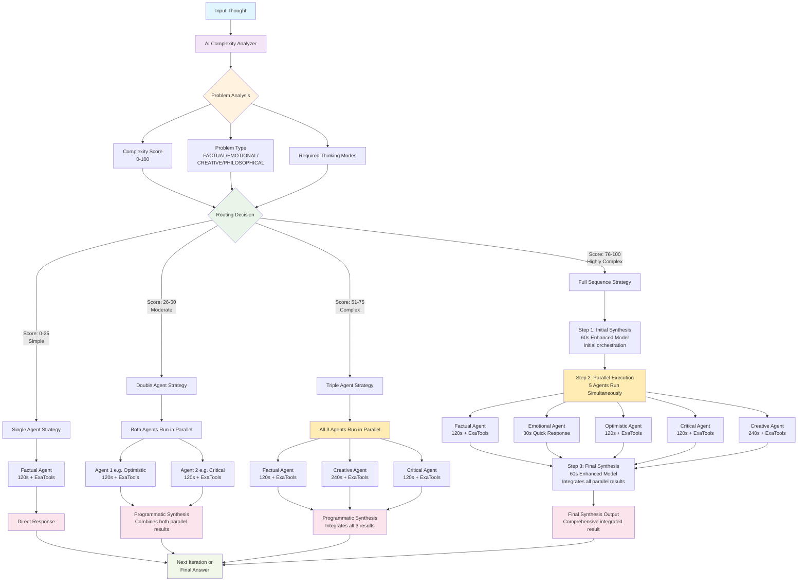

# Sequential Thinking Multi-Agent System (MAS) 

[](https://smithery.ai/server/@FradSer/mcp-server-mas-sequential-thinking) [](https://twitter.com/FradSer) [](https://www.python.org/downloads/) [](https://github.com/cognitivecomputations/agno)

English | [简体中文](README.zh-CN.md)

This project implements an advanced sequential thinking process using a **Multi-Agent System (MAS)** built with the **Agno** framework and served via **MCP**. It represents a significant evolution from simpler state-tracking approaches by leveraging coordinated, specialized agents for deeper analysis and problem decomposition.

[](https://mseep.ai/app/fradser-mcp-server-mas-sequential-thinking)

## What is This?

This is an **MCP server** - not a standalone application. It runs as a background service that extends your LLM client (like Claude Desktop) with sophisticated sequential thinking capabilities. The server provides a `sequentialthinking` tool that processes thoughts through multiple specialized AI agents, each examining the problem from a different cognitive angle.

## Core Architecture: Multi-Dimensional Thinking Agents

The system employs **6 specialized thinking agents**, each focused on a distinct cognitive perspective:

### 1. **Factual Agent**
- **Focus**: Objective facts and verified data
- **Approach**: Analytical, evidence-based reasoning
- **Capabilities**:
  - Web research for current facts (via ExaTools)
  - Data verification and source citation
  - Information gap identification
- **Time allocation**: 120 seconds for thorough analysis

### 2. **Emotional Agent**
- **Focus**: Intuition and emotional intelligence
- **Approach**: Gut reactions and feelings
- **Capabilities**:
  - Quick intuitive responses (30-second snapshots)
  - Visceral reactions without justification
  - Emotional pattern recognition
- **Time allocation**: 30 seconds (quick reaction mode)

### 3. **Critical Agent**
- **Focus**: Risk assessment and problem identification
- **Approach**: Logical scrutiny and devil's advocate
- **Capabilities**:
  - Research counterexamples and failures (via ExaTools)
  - Identify logical flaws and risks
  - Challenge assumptions constructively
- **Time allocation**: 120 seconds for deep analysis

### 4. **Optimistic Agent**
- **Focus**: Benefits, opportunities, and value
- **Approach**: Positive exploration with realistic grounding
- **Capabilities**:
  - Research success stories (via ExaTools)
  - Identify feasible opportunities
  - Explore best-case scenarios logically
- **Time allocation**: 120 seconds for balanced optimism

### 5. **Creative Agent**
- **Focus**: Innovation and alternative solutions
- **Approach**: Lateral thinking and idea generation
- **Capabilities**:
  - Cross-industry innovation research (via ExaTools)
  - Divergent thinking techniques
  - Multiple solution generation
- **Time allocation**: 240 seconds (creativity needs time)

### 6. **Synthesis Agent**
- **Focus**: Integration and metacognitive orchestration
- **Approach**: Holistic synthesis and final answer generation
- **Capabilities**:
  - Integrate all perspectives into coherent response
  - Answer the original question directly
  - Provide actionable, user-friendly insights
- **Time allocation**: 60 seconds for synthesis
- **Note**: Uses enhanced model, does NOT include ExaTools (focuses on integration)

## AI-Powered Intelligent Routing

The system uses **AI-driven complexity analysis** to determine the optimal thinking sequence:

### Processing Strategies:
1. **Single Agent** (Simple questions)
   - Direct factual or emotional response
   - Fastest processing for straightforward queries

2. **Double Agent** (Moderate complexity)
   - Two-step sequences (e.g., Optimistic → Critical)
   - Balanced perspectives for evaluation tasks

3. **Triple Agent** (Core thinking)
   - Factual → Creative → Synthesis
   - Philosophical and analytical problems

4. **Full Sequence** (Complex problems)
   - All 6 agents orchestrated together
   - Comprehensive multi-perspective analysis

The AI analyzer evaluates:
- Problem complexity and semantic depth
- Primary problem type (factual, emotional, creative, philosophical, etc.)
- Required thinking modes for optimal solution
- Appropriate model selection (Enhanced vs Standard)

### AI Routing Flow Diagram



**Key Insights:**
- **Parallel Execution**: Non-synthesis agents run simultaneously for maximum efficiency
- **Synthesis Integration**: Synthesis agents process parallel results sequentially
- **Two Processing Types**:
  - **Synthesis Agent**: Real AI agent using Enhanced Model for integration
  - **Programmatic Synthesis**: Code-based combination when no Synthesis Agent
- **Performance**: Parallel processing optimizes both speed and quality

## Research Capabilities (ExaTools Integration)

**4 out of 6 agents** are equipped with web research capabilities via ExaTools:

- **Factual Agent**: Search for current facts, statistics, verified data
- **Critical Agent**: Find counterexamples, failed cases, regulatory issues
- **Optimistic Agent**: Research success stories, positive case studies
- **Creative Agent**: Discover innovations across different industries
- **Emotional & Synthesis Agents**: No ExaTools (focused on internal processing)

Research is **optional** - requires `EXA_API_KEY` environment variable. The system works perfectly without it, using pure reasoning capabilities.

## Model Intelligence

### Dual Model Strategy:
- **Enhanced Model**: Used for Synthesis agent (complex integration tasks)
- **Standard Model**: Used for individual thinking agents
- **AI Selection**: System automatically chooses the right model based on task complexity

### Supported Providers:
- **DeepSeek** (default) - High performance, cost-effective
- **Groq** - Ultra-fast inference
- **OpenRouter** - Access to multiple models
- **GitHub Models** - OpenAI models via GitHub API
- **Anthropic** - Claude models with prompt caching
- **Ollama** - Local model execution

## Key Differences from Original Version (TypeScript)

This Python/Agno implementation marks a fundamental shift from the original TypeScript version:

| Feature/Aspect      | Python/Agno Version (Current)                                        | TypeScript Version (Original)                        |
| :------------------ | :------------------------------------------------------------------- | :--------------------------------------------------- |
| **Architecture**    | **Multi-Agent System (MAS)**; Active processing by a team of agents. | **Single Class State Tracker**; Simple logging/storing. |
| **Intelligence**    | **Distributed Agent Logic**; Embedded in specialized agents & Coordinator. | **External LLM Only**; No internal intelligence.     |
| **Processing**      | **Active Analysis & Synthesis**; Agents *act* on the thought.      | **Passive Logging**; Merely recorded the thought.    |
| **Frameworks**      | **Agno (MAS) + FastMCP (Server)**; Uses dedicated MAS library.     | **MCP SDK only**.                                    |
| **Coordination**    | **Explicit Team Coordination Logic** (`Team` in `coordinate` mode).  | **None**; No coordination concept.                   |
| **Validation**      | **Pydantic Schema Validation**; Robust data validation.            | **Basic Type Checks**; Less reliable.              |
| **External Tools**  | **Integrated (Exa via Researcher)**; Can perform research tasks.   | **None**.                                            |
| **Logging**         | **Structured Python Logging (File + Console)**; Configurable.      | **Console Logging with Chalk**; Basic.             |
| **Language & Ecosystem** | **Python**; Leverages Python AI/ML ecosystem.                    | **TypeScript/Node.js**.                              |

In essence, the system evolved from a passive thought *recorder* to an active thought *processor* powered by a collaborative team of AI agents.

## How it Works (Multi-Dimensional Processing)

1.  **Initiation:** An external LLM uses the `sequentialthinking` tool to define the problem and initiate the process.
2.  **Tool Call:** The LLM calls the `sequentialthinking` tool with the current thought, structured according to the `ThoughtData` model.
3.  **AI Complexity Analysis:** The system uses AI-powered analysis to determine the optimal thinking sequence based on problem complexity and type.
4.  **Agent Routing:** Based on the analysis, the system routes the thought to the appropriate thinking agents (single, double, triple, or full sequence).
5.  **Parallel Processing:** Multiple thinking agents process the thought simultaneously from their specialized perspectives:
   - Factual agents gather objective data (with optional web research)
   - Critical agents identify risks and problems
   - Optimistic agents explore opportunities and benefits
   - Creative agents generate innovative solutions
   - Emotional agents provide intuitive insights
6.  **Research Integration:** Agents equipped with ExaTools conduct targeted web research to enhance their analysis.
7.  **Synthesis & Integration:** The Synthesis agent integrates all perspectives into a coherent, actionable response using enhanced models.
8.  **Response Generation:** The system returns a comprehensive analysis with guidance for next steps.
9.  **Iteration:** The calling LLM uses the synthesized response to formulate the next thinking step or conclude the process.

## Token Consumption Warning

**High Token Usage:** Due to the Multi-Agent System architecture, this tool consumes significantly **more tokens** than single-agent alternatives or the previous TypeScript version. Each `sequentialthinking` call invokes multiple specialized agents simultaneously, leading to substantially higher token usage (potentially 5-10x more than simple approaches).

This parallel processing leads to substantially higher token usage (potentially 5-10x more) compared to simpler sequential approaches, but provides correspondingly deeper and more comprehensive analysis.

## MCP Tool: `sequentialthinking`

The server exposes a single MCP tool that processes sequential thoughts:

### Parameters:
```typescript
{
  thought: string,              // Current thinking step content
  thoughtNumber: number,         // Sequence number (≥1)
  totalThoughts: number,         // Estimated total steps
  nextThoughtNeeded: boolean,    // Is another step required?
  isRevision: boolean,           // Revising previous thought?
  branchFromThought?: number,    // Branch point (for exploration)
  branchId?: string,             // Branch identifier
  needsMoreThoughts: boolean     // Need to extend sequence?
}
```

### Response:
Returns synthesized analysis from the multi-agent system with:
- Processed thought analysis
- Guidance for next steps
- Branch and revision tracking
- Status and metadata

## Installation

### Prerequisites

- Python 3.10+
- LLM API access (choose one):
    - **DeepSeek**: `DEEPSEEK_API_KEY` (default, recommended)
    - **Groq**: `GROQ_API_KEY`
    - **OpenRouter**: `OPENROUTER_API_KEY`
    - **GitHub Models**: `GITHUB_TOKEN`
    - **Anthropic**: `ANTHROPIC_API_KEY`
    - **Ollama**: Local installation (no API key)
- **Optional**: `EXA_API_KEY` for web research capabilities
- `uv` package manager (recommended) or `pip`

### Quick Start

#### 1. Install via Smithery (Recommended)

```bash
npx -y @smithery/cli install @FradSer/mcp-server-mas-sequential-thinking --client claude
```

#### 2. Manual Installation

```bash
# Clone the repository
git clone https://github.com/FradSer/mcp-server-mas-sequential-thinking.git
cd mcp-server-mas-sequential-thinking

# Install with uv (recommended)
uv pip install .

# Or with pip
pip install .
```

### Configuration

#### For MCP Clients (Claude Desktop, etc.)

Add to your MCP client configuration:

```json
{
  "mcpServers": {
    "sequential-thinking": {
      "command": "mcp-server-mas-sequential-thinking",
      "env": {
        "LLM_PROVIDER": "deepseek",
        "DEEPSEEK_API_KEY": "your_api_key",
        "EXA_API_KEY": "your_exa_key_optional"
      }
    }
  }
}
```

#### Environment Variables

Create a `.env` file or set these variables:

```bash
# LLM Provider (required)
LLM_PROVIDER="deepseek"  # deepseek, groq, openrouter, github, anthropic, ollama
DEEPSEEK_API_KEY="sk-..."

# Optional: Enhanced/Standard Model Selection
# DEEPSEEK_ENHANCED_MODEL_ID="deepseek-chat"  # For synthesis
# DEEPSEEK_STANDARD_MODEL_ID="deepseek-chat"  # For other agents

# Optional: Web Research (enables ExaTools)
# EXA_API_KEY="your_exa_api_key"

# Optional: Custom endpoint
# LLM_BASE_URL="https://custom-endpoint.com"
```

### Model Configuration Examples

```bash
# Groq with different models
GROQ_ENHANCED_MODEL_ID="openai/gpt-oss-120b"
GROQ_STANDARD_MODEL_ID="openai/gpt-oss-20b"

# Anthropic with Claude models
ANTHROPIC_ENHANCED_MODEL_ID="claude-3-5-sonnet-20241022"
ANTHROPIC_STANDARD_MODEL_ID="claude-3-5-haiku-20241022"

# GitHub Models
GITHUB_ENHANCED_MODEL_ID="gpt-4o"
GITHUB_STANDARD_MODEL_ID="gpt-4o-mini"
```

## Usage

### As MCP Server

Once installed and configured in your MCP client:

1. The `sequentialthinking` tool becomes available
2. Your LLM can use it to process complex thoughts
3. The system automatically routes to appropriate thinking agents
4. Results are synthesized and returned to your LLM

### Direct Execution

Run the server manually for testing:

```bash
# Using installed script
mcp-server-mas-sequential-thinking

# Using uv
uv run mcp-server-mas-sequential-thinking

# Using Python
python src/mcp_server_mas_sequential_thinking/main.py
```

## Development

### Setup

```bash
# Clone repository
git clone https://github.com/FradSer/mcp-server-mas-sequential-thinking.git
cd mcp-server-mas-sequential-thinking

# Create virtual environment
python -m venv .venv
source .venv/bin/activate  # On Windows: .venv\Scripts\activate

# Install with dev dependencies
uv pip install -e ".[dev]"
```

### Code Quality

```bash
# Format and lint
uv run ruff check . --fix
uv run ruff format .
uv run mypy .

# Run tests (when available)
uv run pytest
```

### Testing with MCP Inspector

```bash
npx @modelcontextprotocol/inspector uv run mcp-server-mas-sequential-thinking
```

Open http://127.0.0.1:6274/ and test the `sequentialthinking` tool.

## System Characteristics

### Strengths:
- **Multi-perspective analysis**: 6 different cognitive approaches
- **AI-powered routing**: Intelligent complexity analysis
- **Research capabilities**: 4 agents with web search (optional)
- **Flexible processing**: Single to full sequence strategies
- **Model optimization**: Enhanced/Standard model selection
- **Provider agnostic**: Works with multiple LLM providers

### Considerations:
- **Token usage**: Multi-agent processing uses more tokens than single-agent
- **Processing time**: Complex sequences take longer but provide deeper insights
- **API costs**: Research capabilities require separate Exa API subscription
- **Model selection**: Enhanced models cost more but provide better synthesis

## Project Structure

```
mcp-server-mas-sequential-thinking/
├── src/mcp_server_mas_sequential_thinking/
│   ├── main.py                          # MCP server entry point
│   ├── processors/
│   │   ├── multi_thinking_core.py       # 6 thinking agents definition
│   │   └── multi_thinking_processor.py  # Sequential processing logic
│   ├── routing/
│   │   ├── ai_complexity_analyzer.py    # AI-powered analysis
│   │   └── multi_thinking_router.py     # Intelligent routing
│   ├── services/
│   │   ├── thought_processor_refactored.py
│   │   ├── workflow_executor.py
│   │   └── context_builder.py
│   └── config/
│       ├── modernized_config.py         # Provider strategies
│       └── constants.py                 # System constants
├── pyproject.toml                       # Project configuration
└── README.md                            # This file
```

## Changelog

See [CHANGELOG.md](CHANGELOG.md) for version history.

## Contributing

Contributions are welcome! Please ensure:

1. Code follows project style (ruff, mypy)
2. Commit messages use conventional commits format
3. All tests pass before submitting PR
4. Documentation is updated as needed

## License

This project is licensed under the MIT License - see the LICENSE file for details.

## Acknowledgments

- Built with [Agno](https://github.com/agno-agi/agno) v2.0+ framework
- Model Context Protocol by [Anthropic](https://www.anthropic.com/)
- Research capabilities powered by [Exa](https://exa.ai/) (optional)
- Multi-dimensional thinking inspired by Edward de Bono's work

## Support

- GitHub Issues: [Report bugs or request features](https://github.com/FradSer/mcp-server-mas-sequential-thinking/issues)
- Documentation: Check CLAUDE.md for detailed implementation notes
- MCP Protocol: [Official MCP Documentation](https://modelcontextprotocol.io/)

---

**Note**: This is an MCP server, designed to work with MCP-compatible clients like Claude Desktop. It is not a standalone chat application.
